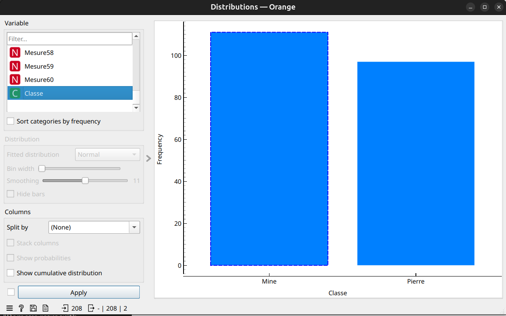
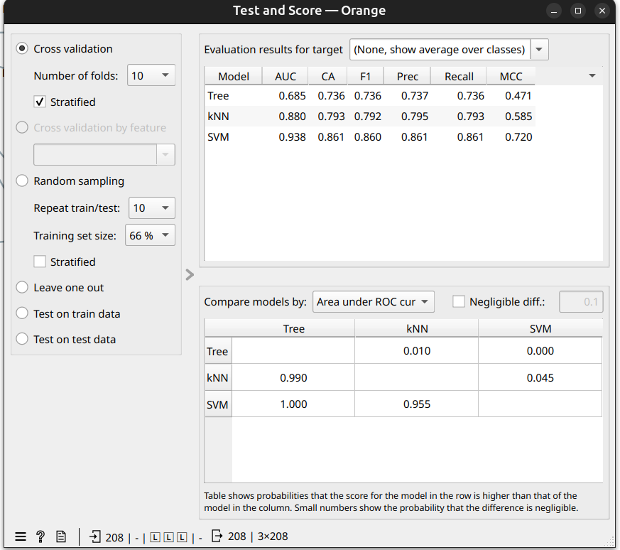
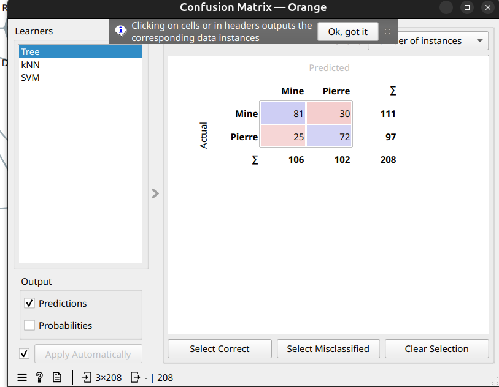
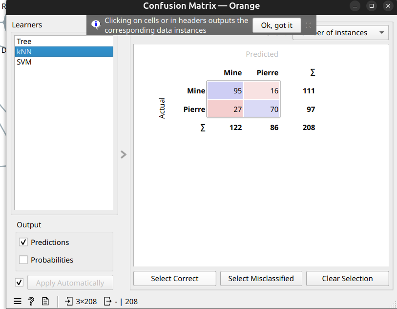
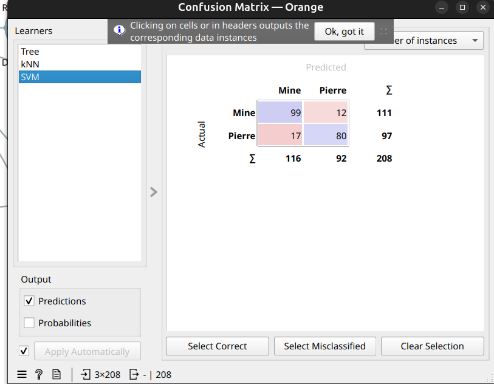
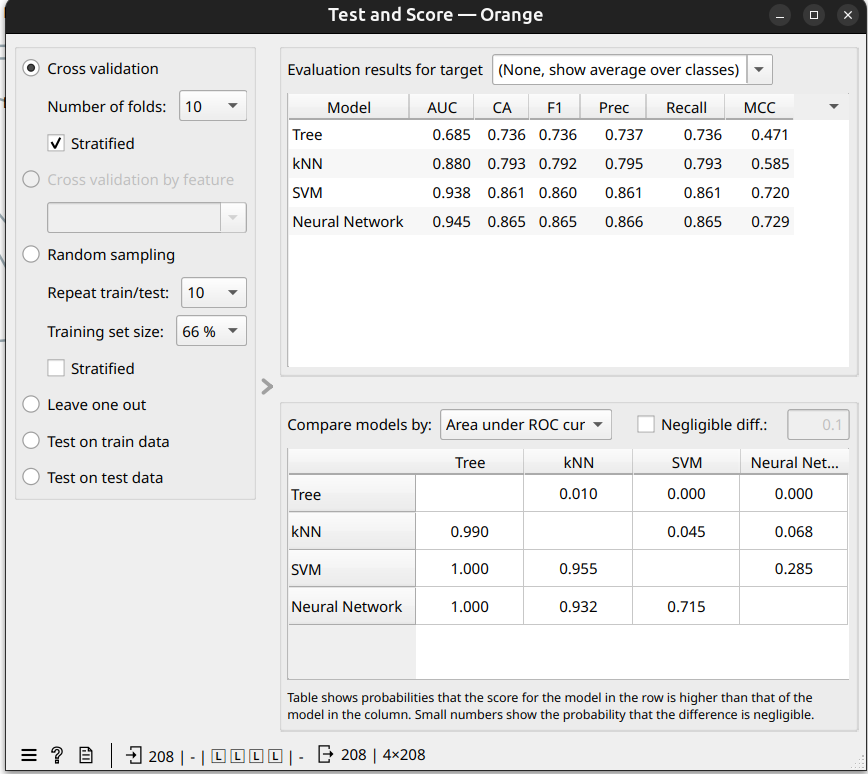
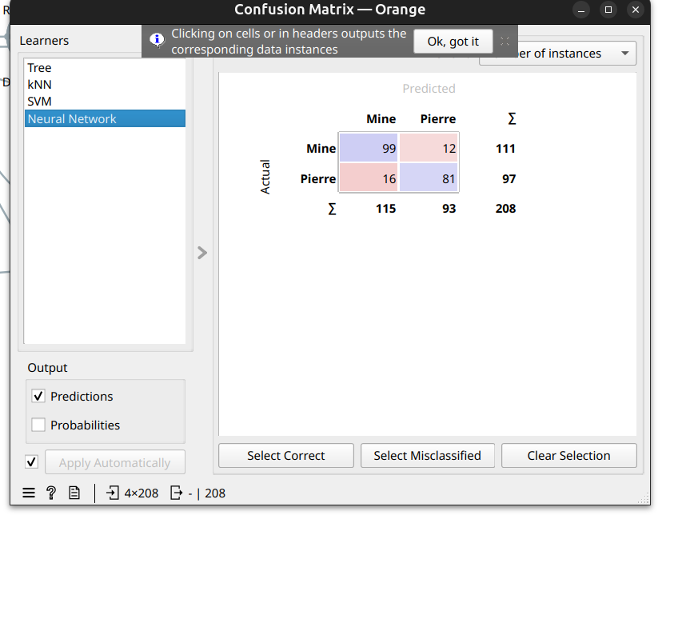

# Détection de Mines Sous-Marines — Classification Binaire avec Orange Data Mining

## Contexte

Projet de Data Mining réalisé dans le cadre d'un partiel. L'objectif est de classifier automatiquement des signaux sonar comme **Mine** ou **Pierre** (roche) à l'aide d'Orange Data Mining, en comparant plusieurs algorithmes de machine learning.

## Données

- **Source** : Dataset Sonar (signaux sonar réfléchis sur des objets sous-marins)
- **Taille** : 208 instances
- **Variables** : 60 mesures continues (Mesure1 à Mesure60) représentant l'énergie du signal dans différentes bandes de fréquences
- **Répartition** : 111 Mine (53.4%) / 97 Pierre (46.6%)

## Distribution des classes

Le dataset est quasiment équilibré (ratio ~53/47), ce qui est favorable pour l'entraînement des modèles sans nécessiter de techniques de rééquilibrage.

---

## Résultats — Phase 1 : 3 modèles (Tree, kNN, SVM)

### Test and Score

| Modèle | AUC | Accuracy | F1 | Precision | Recall | MCC |
|--------|-----|----------|----|-----------|--------|-----|
| Tree | 0.685 | 73.6% | 0.736 | 0.737 | 0.736 | 0.471 |
| kNN | 0.880 | 79.3% | 0.792 | 0.795 | 0.793 | 0.585 |
| **SVM** | **0.938** | **86.1%** | **0.860** | **0.861** | **0.861** | **0.720** |

SVM domine nettement avec une AUC de 0.938 et une accuracy de 86.1%.

### Matrices de confusion

#### Tree (73.6%)

| | Prédit Mine | Prédit Pierre |
|---|---|---|
| **Réel Mine** | 81 (TN) | 30 (FP) |
| **Réel Pierre** | 25 (FN) | 72 (TP) |

- 55 erreurs au total — le modèle a du mal à distinguer les deux classes.

#### kNN (79.3%)

| | Prédit Mine | Prédit Pierre |
|---|---|---|
| **Réel Mine** | 95 (TN) | 16 (FP) |
| **Réel Pierre** | 27 (FN) | 70 (TP) |

- 43 erreurs — meilleur que Tree, mais 27 pierres sont classées comme mines (faux négatifs élevés).

#### SVM (86.1%)

| | Prédit Mine | Prédit Pierre |
|---|---|---|
| **Réel Mine** | 99 (TN) | 12 (FP) |
| **Réel Pierre** | 17 (FN) | 80 (TP) |

- 29 erreurs seulement — le meilleur résultat parmi les 3 modèles.

---

## Résultats — Phase 2 : ajout de Neural Network

### Test and Score avec 4 modèles

| Modèle | AUC | Accuracy | F1 | Precision | Recall | MCC |
|--------|-----|----------|----|-----------|--------|-----|
| Tree | 0.685 | 73.6% | 0.736 | 0.737 | 0.736 | 0.471 |
| kNN | 0.880 | 79.3% | 0.792 | 0.795 | 0.793 | 0.585 |
| SVM | 0.938 | 86.1% | 0.860 | 0.861 | 0.861 | 0.720 |
| **Neural Network** | **0.945** | **86.5%** | **0.865** | **0.866** | **0.865** | **0.729** |

Neural Network surpasse légèrement SVM avec une AUC de 0.945 et une accuracy de 86.5%.

### Matrice de confusion — Neural Network (86.5%)

| | Prédit Mine | Prédit Pierre |
|---|---|---|
| **Réel Mine** | 99 (TN) | 12 (FP) |
| **Réel Pierre** | 16 (FN) | 81 (TP) |

- 28 erreurs — le meilleur résultat global.
- Le profil d'erreurs est très similaire à SVM, avec un faux négatif en moins.

---

## Comparaison des modèles

### Analyse des erreurs

| Modèle | Faux Positifs (Mine → Pierre) | Faux Négatifs (Pierre → Mine) | Total erreurs | Verdict |
|--------|-------------------------------|-------------------------------|---------------|---------|
| Tree | 30 (27.0%) | 25 (25.8%) | 55 | ❌ Insuffisant |
| kNN | 16 (14.4%) | 27 (27.8%) | 43 | ⚠️ Acceptable |
| SVM | 12 (10.8%) | 17 (17.5%) | 29 | ✅ Bon |
| Neural Network | 12 (10.8%) | 16 (16.5%) | 28 | ✅ Meilleur |

### Comparaison AUC (probabilité qu'un modèle soit meilleur)

La table de comparaison par AUC montre que SVM et Neural Network sont significativement supérieurs à Tree (p = 0.000) et à kNN (p < 0.07). La différence entre SVM et Neural Network n'est pas statistiquement significative (p = 0.285), ce qui suggère des performances équivalentes.

---

## Classement final

1. **Neural Network (86.5%)** — Meilleure AUC (0.945) et accuracy, capture bien les patterns complexes des signaux sonar
2. **SVM (86.1%)** — Performances très proches du Neural Network, plus simple à interpréter et à déployer
3. **kNN (79.3%)** — Résultats corrects mais sensible au choix de k et à la dimensionnalité
4. **Tree (73.6%)** — Performance la plus faible, probablement limité par la nature continue et haute dimensionnalité des données sonar

## Modèle recommandé

**SVM** est recommandé pour la production : ses performances sont quasi identiques au Neural Network (différence non significative), il est plus robuste, moins coûteux en calcul et moins sujet au sur-apprentissage sur un petit dataset de 208 instances.

## Reproductibilité

- **Cross-validation** : 10 folds, stratifiée
- **Outil** : Orange Data Mining (fichier `partiel.ows`)

## Conclusion

Sur ce problème de détection de mines sous-marines, SVM et Neural Network atteignent des performances similaires (~86%) et significativement supérieures aux autres approches. Le faible volume de données (208 instances pour 60 variables) représente un défi : le ratio observations/variables est faible, ce qui explique les performances modestes de l'arbre de décision et rend cruciale l'utilisation d'algorithmes capables de bien gérer les espaces de haute dimensionnalité, comme SVM.